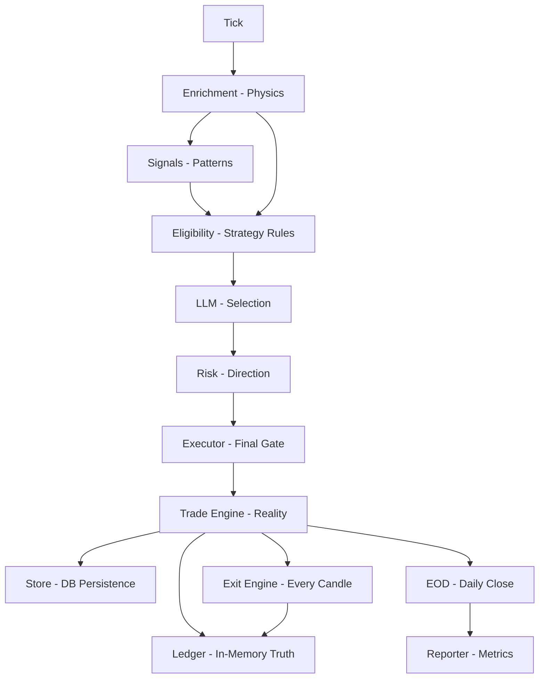

# 🧠 GEMINI Knowledge Base: The Only Truth Architecture

This document serves as the **Long-Term Memory** for developers (AI and Human) working on the Beast. It captures the non-negotiable architectural laws that govern the system to ensure research validity and execution determinism.

## 🏛️ Core Philosophy: The One Rule

**Anything derived purely from market data = Enrichment layer.**
**Anything that decides actions = Decision layers.**
**Anything that sends orders = Executor.**
**Modes (backtest/live/mock) NEVER compute market physics.**

### 🏛️ The Laws of Sovereignty (v2.9.3)
1.  **The Physical Authority Principle**: `EDGE_STATE` is not a metric; it is a Control Primitive. If `EDGE_STATE == DEAD`, the system must exit immediately. No intelligence layer (Brain/Regime) has the authority to override this death.
2.  **The D2 Formation Constraint**: `D2 Radar` is a **Formation Sensor** (predicting the birth of an edge/regime shift), NOT a death sensor. Edge death is exclusively governed by Physics (Velocity/Entropy/Regime Invalidation).
3.  **The Alpha-TGT Boundary**: In high-alpha regimes (9, 11), static `Targets (TGT)` are illegal. They are Phase-2 artifacts. In Phase-3, Alpha trades run until the **Physics Engine** (Edge Death) or **Risk Layer** (SL/MFE) terminates them.
4.  **Governance Hierarchy**: `SL (Safety) > EDGE_STATE (Physics) > MFE (Math) > BRAIN (Narration)`.

### 🏛️ Data Persistence & Epistemology Store ⭐ UPDATED v2.8.3

| File | Role | Location | Purpose |
| :--- | :--- | :--- | :--- |
| **`trading.db`** | **The Spine** | `data/` | **GOLD SOURCE.** Contains NIFTY 2023-2026 candles. |
| **`market_states.parquet`** | **The Features (X)** | `atlas/data/` | Normalized state vectors for machine learning. |
| **`outcomes.parquet`** | **The Results (y)** | `atlas/data/` | Aligned trade outcomes (PnL/MAE) - Joined via `trade_id`. |
| **`trading_audit.db`** | **The Judge** | `data/` | Simulation logs and counterfactual records. |
| **`trading.db` (ROOT)** | **GHOST** | `root` | **DELETE.** Legacy placeholder from migration. |

### North Star Invariants
If any of these are violated, the system is invalid:
1.  **No file > 300 LOC**.
2.  **No threshold exists in Python code** (Must be in Config).
3.  **Every trade decision is traceable end-to-end**.
4.  **LLM cannot veto eligibility** (Only selects preferences).
5.  **Zero-trade day must explain exactly why** (Traceability).
6.  **Modes are Adapters**: `backtest.py` and `live.py` only feed candles; they never calculate indicators (ATR, TER, etc.).

---

## 🗺️ The Canonical Logic Map

### 1. Market Physics (Enrichment)
**Where**: `enrichment/`
**Role**: "What is reality?" (Facts only, Numbers only, No Decisions)

| Metric | Computed In | Why |
| :--- | :--- | :--- |
| **ATR** | `enrichment/volatility.py` | Universal volatility physics. |
| **OR Range** | `enrichment/volatility.py` | Market structure foundation. |
| **Trend Efficiency (TER)** | `enrichment/trend.py` | Structural quality metric. |
| **Momentum Slope** | `enrichment/trend.py` | Directional force. |
| **Support/Resistance** | `enrichment/levels.py` | Structural anchors. |
| **Location Class** | `enrichment/location.py` | Contextual positioning (MID/NEAR/EXTREME). |

### 2. Microstructure Signals
**Where**: `signals/`
**Role**: "What patterns exist?" (Booleans only, No Thresholds/Logic)

| Signal | Computed In | Purpose |
| :--- | :--- | :--- |
| **Stall** | `signals/stall.py` | Reversion trigger (REMR). |
| **Rejection** | `signals/rejection.py` | Mean reversion confirmation. |
| **Compression** | `signals/compression.py` | Breakout precursor (VBD). |
| **Range Break** | `signals/range_break.py` | Volatility Breakout trigger. |
| **Structural Break** | `signals/structural_break.py` | Trend impulse signal. |

### 3. Strategy Eligibility (First Decision Layer)
**Where**: `eligibility/style_eligibility.py`
**Role**: "Is this style structurally allowed?"

This is the **Gatekeeper**. It consumes Enrichment + Signals + Config.
*   **REMR**: Allowed if `Near Level` + (`Stall` OR `Rejection`).
*   **ITC**: Allowed if `Trend Regime` + `High TER`.
*   **Output**: Map of eligible styles (`{'REMR': True, 'ITC': False}`).

### 4. Confidence Engine (Quality Scoring)
**Where**: `confidence/confidence_engine.py`
**Role**: "How strong is the setup?" (Pure Math)

Input: Style, Enrichment, Signals.
Output: Score (0.0 - 1.0).
*   Base Score (Config).
*   Adjustments (e.g., `+0.1 if Near Level`, `-0.05 if Low VIX`).
*   **No Decisions**: Does not say "Yes/No", only "How much".

### 5. LLM Selector (Preference Function)
**Where**: `llm_selector/selector.py`
**Role**: "Which allowed style feels best?" (Heuristic)

*   **Input**: Market State + **Eligible Styles Only**.
*   **Output**: Selected Style.
*   **Constraint**: Cannot veto eligibility. Cannot invent styles. Cannot apply thresholds.

### 6. Risk Layer (Direction & Expression)
**Where**: `risk/`
**Role**: "How to express the trade?"

*   **Direction**: `decide_direction` (BUY_CALL / BUY_PUT / HOLD).
*   **Countertrend**: Checks strictly against structural breaks.
*   **Rotational Override**: Can block trades in Chop (Rotational regimes).

### 7. Executor (Final Authority)
**Where**: `executor/execute.py`
**Role**: "The Judge & Executioner"

The **ONLY** place that can block a trade based on scores.
*   **Rule**: If `Confidence < Config[Style].Confidence_Floor` → **HOLD**.
*   **Action**: Proposes trades to Trade Engine.

### 8. Trade Engine (The Spine) ⭐ NEW v2.8
**Where**: `trade/`
**Role**: "What actually happened?" (Reality, not Theory)

The **single source of truth** for all trade state, execution, and reporting.

| Module | Responsibility |
| :--- | :--- |
| `trade/models.py` | Trade, ExitEvent, DailySummary dataclasses |
| `trade/store.py` | SQLite persistence (`trades` table) |
| `trade/ledger.py` | In-memory position state (MFE/MAE tracking) |
| `trade/lifecycle.py` | State machine: PROPOSED → OPEN → CLOSED |
| `trade/exit_engine.py` | SL/TGT exits (runs **every candle**) |
| `trade/eod.py` | EOD force-close + daily stats |
| `trade/reporter.py` | Session reports with style/exit breakdowns |

### 10. The Antigravity Stack (v2.9) ⭐ NEW
**Where**: `engine/research_engine.py` & `brain/llm_client.py`
**Role**: "The Flight Computer"

Replaces stochastic logic with a deterministic, monitorable pipeline.

1.  **Atlas (The Truth)**: Identifies Regime Cluster (e.g., R11).
2.  **Transition Engine**: Maps R_curr → R_next probabilities.
3.  **D2 Radar (The Timing)**: **PERMANENTLY ENABLED**. Predicts transition probability.
4.  **Policy Gate**: Static permissions (`policy_table_v1.yaml`).
5.  **In-Trade Monitor**:
    *   Runs every 15 mins on ACTIVE trades.
    *   **Actions**: `HOLD` (Default), `TIGHTEN` (Advisory), `EXIT` (Force Close).
    *   **Trigger**: Thesis invalidation (e.g., Regime shift to Trap).

### 11. RAG Persistence (The Memory)
**Where**: `data/database.py` (Nuggets), `trade/eod.py` (Save)
**Role**: "Lessons Learned"

**North Star**: RAG must never leak future data into the past.
- [x] **Retrieval**: `WHERE created_at < simulated_now`.
- [x] **Storage**: `save_experience(timestamp=simulated_now)`.
- [x] **Result**: Perfect temporal causality in backtests.

### 12. Sage Hyper-Vector Architecture (v3.0) ⭐ NEW
**Status**: Data Extraction Rig Live (Phase 8.1).
**Goal**: Move from "Heuristic Engine" to "Truly Autonomous AI."

The system now creates a **Sage Master Vector** by joining three distinct data layers:

1.  **Atlas Physics (X1)**: Numerical state vectors (Velocity, Entropy, TER) from `market_states.parquet`.
2.  **Structural Reasoning (X2)**: Strict JSON technical vectors (Biased Bull/Bear/Neutral paths) from `knowledge_nuggets`.
3.  **Oracle Outcomes (y)**: Ground-truth results (MFE/MAE/PnL) for all branches.

**The Training Sample Structure**:
```json
{
  "numerical_context": "Atlas Vector (60+ dimensions)",
  "v3_reasoning_paths": {
    "BULL": "Biased Technical Logic + Confidence",
    "BEAR": "Biased Technical Logic + Confidence",
    "NEUTRAL": "Observational Balance"
  },
  "ground_truth_y": "Best Branch (CALL/PUT/HOLD) based on actual MFE/MAE"
}
```
**North Star**: Future inference will choose the "Reasoning Path" that most closely matches the actual outcome for the current Physics context.

**Trade Lifecycle:**
```
PROPOSED → OPEN → ACTIVE → EXITED → CLOSED → ARCHIVED (EOD)
```

**Non-Negotiables:**
*   **Visualization**: Logs must use ANSI colors ("The Matrix") for observability.
*   **No "implicit close"**: Every exit is logged.
*   **State Machine**: Enforces transitions.
*   **Ledger is truth**: DB is history.

---

## ⚡ The True Execution Flow (Daily Mantra)



## 🐛 Root Cause Analysis (RCA): The Zero-Value Plague

During the v2.8 migration, a critical bug caused indicators (ATR, TER, OR Range) to return `0.0`. 

### 1. Resolution Bias (Empty Table Trap)
*   **Issue**: `fetch_context_data` was hardcoded to `candles_1min`. However, backtests often only prefill `candles_5min`.
*   **Result**: The enrichment layer searched an empty table, returning empty lists, which mathematical functions (like ATR) defaulted to `0.0`.
*   **Prevention**: Always use **Resolution-Aware Fetching**. Detect if `1min` data exists; if not, fallback to `5min`.

### 2. Stateless Tick Construction (The Warmup Gap)
*   **Issue**: `BacktestMode` was creating "naked" ticks on every candle, passing only the day's current price action.
*   **Result**: Indicators requiring prior history (e.g., ATR 14) had no "warmup" data for the first 14 candles of the day, causing them to fail or stay zero.
*   **Prevention**: Ticks MUST be **Context-Rich**. Always inject the `daily_context` (fetched at 09:15) into every tick packet to provide the necessary historical lookback.

### 3. Timestamp Fragility
*   **Issue**: Time-parsing logic in `opening_range.py` expected ISO strings (`YYYY-MM-DD HH:MM:SS`) to extract `[11:16]`. `BacktestMode` was passing only `HH:MM:SS`.
*   **Result**: Comparison `if "09:15" <= time_str <= "10:00"` failed silently, returning an empty range.
*   **Prevention**: Use **Full ISO Timestamps** throughout the pipeline. Never pass partial time strings to enrichment modules.

### 4. Database Concurrency (Locking)
*   **Issue**: Expensive `UNION` queries across large tables in a single transaction caused `OperationalError: database is locked`.
*   **Result**: Context fetching failed mid-tick, leading to missing data in decision logs.
*   **Prevention**: Avoid `UNION` on hot paths. Perform a quick metadata check for the table name first, then query the specific table.

---

## 🛠️ Maintenance Protocols

### 1. Adding a New Signal
1.  **Create** `signals/new_pattern.py`. Return `True/False`.
2.  **Update** `engine/research_engine.py` to call it.
3.  **Update** `eligibility/style_eligibility.py` to use it in a strategy.

### 2. Changing a Threshold (e.g., REMR distance)
1.  **NEVER** touch Python code.
2.  **Update** `config/trading_config.json`.
3.  **Verify** `config/config_loader.py` handles it.

### 3. Debugging a "Missing Trade"
Follow the Trace Chain in logs:
1.  `REMR_candidate`: Was it eligible? (Check `eligibility`)
2.  `REMR_survived_risk`: Did Risk layer allow direction?
3.  `REMR_survived_confidence`: Was Score > Floor? (Check `confidence` vs `config`)
4.  `REMR_executed`: Did Broker accept it?

---

## 🚀 Speed Guidelines: How to implement 2x Faster

### 1. Contract-First Logic Changes
**Problem**: Logic errors due to missing data keys.
**Solution**: Define the `Contract` first.
*   "To detect V-Reversal, I need `daily_low` in enrichment."
*   Add to `ResearchEngine` enrichment **before** writing the signal logic.

### 2. Proactive Signature Audits
**Problem**: Helper functions assuming local scope variables.
**Solution**: Pass everything explicitly.
*   Bad: `def check(x): return x > context['atr']`
*   Good: `def check(x, atr): return x > atr`

### 3. Log-Driven Verification
**Problem**: Waiting for full backtests.
**Solution**: Use `logger.info(f"[TRACE] {value}")` and run a 10-minute slice to verify data flow before full simulation.


---

*This document is the supreme law of the codebase. Any code violating these layers is a bug.*
