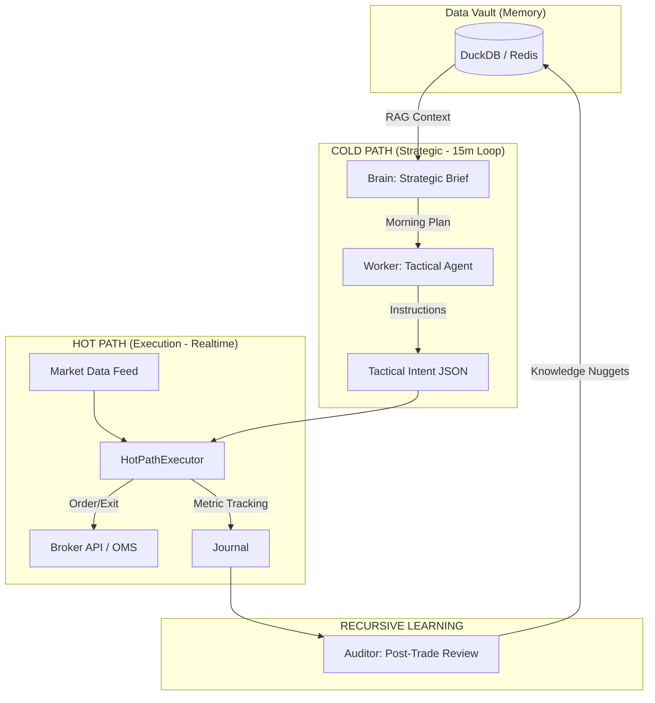

# 🐉 Project Explainer: Stock AI Beast (v4.0)
**The Sovereign Algorithmic Trading Engine**

---

## 💎 1. Executive Summary: The Investment Thesis
Trading is a solved problem for machines, but a psychological nightmare for humans. **Stock AI Beast** is a hybrid intelligence system designed to decouple high-level market context ("Strategic Thinking") from split-second trade management ("Deterministic Execution"). 

By leveraging **Dual-Path Architecture**, the Beast eliminates the two biggest killers of capital:
1.  **Human Emotion**: Greed, fear, and loss-aversion during a trade.
2.  **AI Latency/Hallucination**: The risk of an LLM making a slow decision or hallucinating during a high-speed price spike.

---

## 🌪️ 2. The Problem: The "Behavioral Gap"
Elite traders lose money not because they can't see the trend, but because they can't follow their own rules when under pressure.
*   **Context Loss**: Traders focus on the 1-minute chart and lose sight of the Daily/Hourly trend.
*   **Rule Slippage**: Moving a Stop Loss "just a little bit" to avoid a hit.
*   **Latency**: AI models are powerful but too slow (2-5s) to manage a live trade during a 50-point NIFTY move.

---

## 🏛️ 3. The Solution: Dual-Path Hybrid Architecture

The Beast splits the system into two distinct workflows:

### A. The Cold Path (Strategic Intelligence)
*   **Frequency**: Every 15 minutes (or on major events).
*   **Engine**: High-parameter LLMs (Qwen 14B/32B).
*   **Function**: Context synthesis. It analyzes multi-timeframe trends, VIX volatility, and Options Greeks to issue "Tactical Intent." It doesn't execute; it **commands**.

### B. The Hot Path (Deterministic Execution)
*   **Frequency**: Every 100 milliseconds (Tick-by-Tick).
*   **Engine**: Pure Python Rules Engine.
*   **Function**: Execution. It follows the Tactical Intent exactly. If the price hits the SL, it exits. There is **no negotiation** and **no AI calls** during these milliseconds, ensuring zero-latency safety.

---

## 🗺️ 4. System Flow & Architecture

### Flow Breakdown:
1.  **Ingestion**: Market Data is prefilled into DuckDB for historical context and streamed via Redis for live updates.
2.  **Stratification**: The **Brain** creates a "Personality Brief" at 9:15 AM (Trending/Choppy/Gap-Fill).
3.  **Instruction**: The **Worker** generates a "Tactical Intent" every 15 minutes, defining the exact Entry-Low, Entry-High, SL, and Target based on current VIX.
4.  **Enforcement**: The **HotPathExecutor** monitors the price. If price enters the range, it submits the order. If SL is hit, it cuts the trade instantly.
5.  **Recursive Tuning**: After 3:30 PM, the **Auditor** reviews every trade. It identifies *Greed Gaps* (where PnL was peak but not taken) and writes a "Nugget" (e.g., *"In Panic VIX, trailing stops must be tightened at +20pts"*).

---

## 🚀 5. Key Technical Innovations

### 🛡️ Self-Healing AI Infrastructure
LLMs sometimes output "dirty" JSON. The Beast features a **Heuristic JSON Recovery** system that can balance broken braces, close un-terminated quotes, and repair truncated responses in real-time without crashing the engine.

### 📈 VIX-Regime Adaptive Risk
Most bots use fixed Stop Losses. The Beast calculates SL as a function of **ATR (Average True Range) × VIX Multiplier**. 
*   **VIX < 13 (Complacent)**: Tight stops (30pts) to capture micro-trends.
*   **VIX > 18 (Panic)**: Wide volatility buffers (60pts) to avoid being "hunted" by market makers.

### 💎 Experience RAG (Recursive Learning)
Unlike traditional bots that stay "frozen" in logic, the Beast builds a private Knowledge Base of its own successes and failures. This "Experience Vault" is fed back into the LLM prompts, allowing it to "remember" how the market behaved in similar historical regimes.

---

## 💼 6. Market Scalability
While currently optimized for **NSE Index Options (NIFTY/BANKNIFTY)**, the engine is modular:
*   **Asset Agnostic**: Can be pivoted to Forex or Crypto by swapping the `BrokerAPI` class.
*   **Model Agnostic**: Can run on self-hosted local models (Ollama/vLLM) for data privacy or cloud APIs (OpenAI/Google Vertex) for scale.

---
**The Stock AI Beast isn't just a bot; it's a quantitative fund manager with a deterministic bodyguard.**
