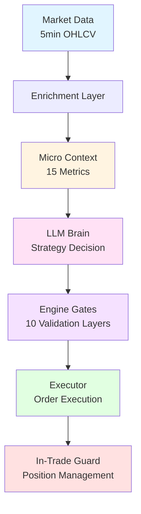
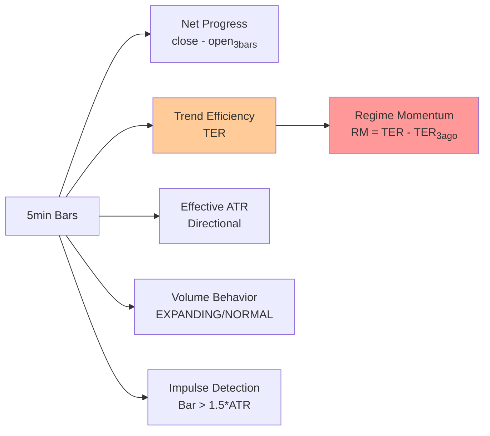
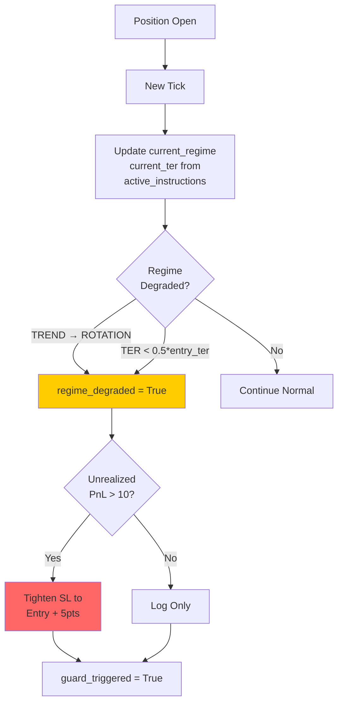
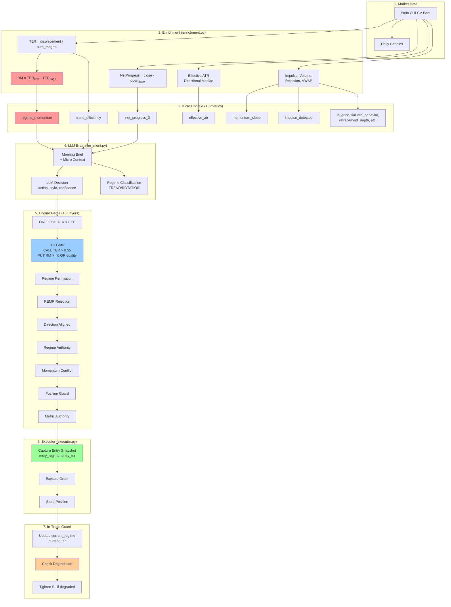
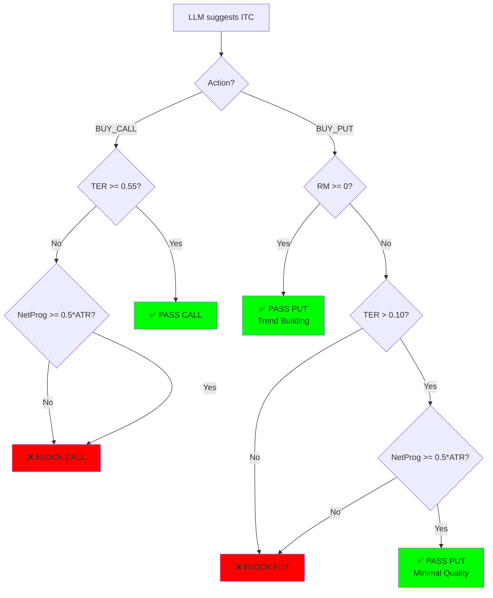

# Beast Trading System - End-to-End Data Flow

## Overview: The Complete Lifecycle



---

## Phase 1: Data Enrichment (enrichment.py)

### Input
- **Raw Market Data**: `today_5min` (list of OHLCV bars)
- **Daily Context**: `daily_3` (last 3 daily candles)
- **Current State**: `close`, `atr_14`, `vwap`

### Calculations Performed



### Metrics Generated (micro_context)

| Metric | Calculation | Purpose |
|--------|-------------|---------|
| **net_progress_3** | `close - open_3bars_ago` | Directional momentum |
| **trend_efficiency (TER)** | `abs(net_displacement) / sum(ranges)` | Trend quality (0-1) |
| **regime_momentum (RM)** | `TER_now - TER_3bars_ago` | Rate of trend change |
| **effective_atr** | `median(directional_candle_ranges)` | Asymmetric volatility |
| **momentum_slope** | `(close - close_3bars) / 3` | Velocity |
| **impulse_detected** | `any(bar_range > 1.5*ATR)` | Energy spike |
| **volume_behavior** | `EXPANDING` if `vol > 1.3*avg` | Participation |
| **retracement_depth** | `SHALLOW/NORMAL/DEEP` | Pullback |
| **is_grind** | `TER > 0.35 AND !impulse` | Slow trend |
| **rejection_pattern** | `BULL_HAMMER/BEAR_SHOOT` | Behavioral |
| **v_reversal** | `Exhaustion + Fast recovery` | V-bottom |
| **vwap** | `sum(price*vol) / sum(vol)` | Fair value |

---

## Phase 2: LLM Strategy Decision (llm_client.py)

### Input to Brain
- **Micro Context** (15 metrics from enrichment)
- **Reference Levels** (S1, Pivot, R1)
- **Morning Brief** (bias, expected move)
- **Open Position** (if any)

### LLM Output (JSON)
```json
{
  "action": "BUY_CALL|BUY_PUT|HOLD",
  "selected_style": "ITC|REMR|ORE",
  "confidence": 0.0-1.0,
  "active_regime": "IMPULSE_TREND|TREND_GRIND|TRANSITION|ROTATION",
  "trend_direction": "BULLISH|BEARISH|NEUTRAL",
  "trend_strength": 123.4,
  "regime": "...",
  "is_counter_trend": true|false
}
```

---

## Phase 3: Engine Validation Gates (llm_client.py)

```mermaid
graph TB
    START[LLM Suggests<br/>BUY_CALL/PUT] --> G1{Gate 1:<br/>ORE Valid?}
    G1 -->|TER < 0.50| BLOCK1[BLOCK: ORE]
    G1 -->|Pass| G2{Gate 2:<br/>ITC Valid?}
    
    G2 -->|CALL: TER < 0.55| BLOCK2A[BLOCK: ITC CALL]
    G2 -->|PUT: RM < 0 AND<br/>TER < 0.10| BLOCK2B[BLOCK: ITC PUT]
    G2 -->|Pass| G3{Gate 3:<br/>Regime Permission?}
    
    G3 -->|ROTATION + TER < 0.12| BLOCK3[BLOCK: Rotation]
    G3 -->|Pass| G4{Gate 4:<br/>REMR Rejection?}
    
    G4 -->|No Pattern| BLOCK4[BLOCK: REMR]
    G4 -->|Pass| G5{Gate 5:<br/>Direction Aligned?}
    
    G5 -->|Mismatch| BLOCK5[BLOCK: Direction]
    G5 -->|Pass| G6{Gate 6:<br/>Regime Authority?}
    
    G6 -->|Counter-Trend| BLOCK6[BLOCK: Authority]
    G6 -->|Pass| G7{Gate 7:<br/>Momentum Conflict?}
    
    G7 -->|Conflict (Bypass REMR)| BLOCK7[BLOCK: Momentum]
    G7 -->|Pass| G8{Gate 8:<br/>Position Guard?}
    
    G8 -->|Already Open| BLOCK8[BLOCK: Position]
    G8 -->|Pass| G9{Gate 9:<br/>Metric Authority}
    
    G9 -->|Boost Conf| G10[Gate 10:<br/>Structural Target Guard]
    G10 -->|Target > Level| CLAMP[Clamp Target @ Level]
    G10 --> EXEC[✅ Pass to Executor]
    
    style EXEC fill:#00ff00
    style BLOCK1 fill:#ff6666
    style BLOCK2A fill:#ff6666
    style BLOCK2B fill:#ff6666
    style BLOCK3 fill:#ff6666
    style BLOCK4 fill:#ff6666
    style BLOCK5 fill:#ff6666
    style BLOCK6 fill:#ff6666
    style BLOCK7 fill:#ff6666
    style BLOCK8 fill:#ff6666
```

### Gate Details

#### Gate 2: ITC Validation (Phase 2.7)
**CALL Logic** (Absolute TER):
```python
if ter < 0.55 AND net_prog < 0.5*ATR:
    BLOCK
```

**PUT Logic** (Regime Momentum):
```python
rm_ok = regime_momentum >= 0
quality_ok = (ter > 0.10 AND net_prog > 0.5*ATR)

if NOT (rm_ok OR quality_ok):
    BLOCK
```

#### Gate 7: Momentum Conflict (REMR Bypass)
```python
if action_momentum_conflict AND sel_style != 'REMR':
    # ITC and ORE are blocked if momentum is directly opposite.
    # REMR is EXEMPT as it is a reversal/fade style.
    BLOCK
```

#### Gate 10: Structural Target Guard (Phase 2.7b)
```python
if action == 'BUY_CALL' AND target > resistance:
    target = resistance  # Clamp to structural ceiling
if action == 'BUY_PUT' AND target < support:
    target = support     # Clamp to structural floor
```

---

## Phase 4: Executor Entry (executor.py)

### Instructions Received
```python
{
    'action': 'BUY_CALL|BUY_PUT',
    'entry_price': float,
    'sl': float,
    'target': float,
    'selected_style': str,
    'confidence': float,
    'active_regime': str,
    'micro_context': {
        'trend_efficiency': float,
        'regime_momentum': float,
        ...
    }
}
```

### Position Metadata Captured (Phase 2.6)
```python
open_position = {
    'side': 'CALL|PUT',
    'entry_price': price,
    'sl': sl,
    'target': target,
    'style': style,
    'entry_regime': active_regime,  # Snapshot
    'entry_ter': ter,  # Snapshot
    'current_regime': active_regime,  # Updated live
    'current_ter': ter,  # Updated live
    'peak_price': price,
    'max_pnl': 0.0
}
```

---

## Phase 5: In-Trade Guard (executor.py, Phase 2.6)



### Guard Logic
```python
start_regime = pos['entry_regime']
curr_regime = pos['current_regime']
start_ter = pos['entry_ter']
curr_ter = pos['current_ter']

# Detect Degradation
if (start_regime in ['IMPULSE_TREND', 'TREND_GRIND'] 
    AND curr_regime in ['ROTATION', 'RANGE']):
    regime_degraded = True

if start_ter > 0.4 AND curr_ter < (0.5 * start_ter):
    regime_degraded = True
    
# De-risk
if regime_degraded AND unrealized_pnl > 10:
    new_sl = entry_price + 5  # Breakeven+
```

---

## Complete Data Flow Diagram



---

## Key Metric Formulas

### Trend Efficiency Ratio (TER)
```
TER = |Close[n] - Open[0]| / Σ(High - Low)
```
- **Range**: 0.0 (choppy) to 1.0 (perfect trend)
- **Bullish Days**: 0.60-0.90 (smooth melt-up)
- **Bearish Days**: 0.05-0.30 (choppy breakdown)

### Regime Momentum (RM)
```
RM = TER[0:3] - TER[3:6]
```
- **Positive**: Trend improving
- **Negative**: Trend deteriorating
- **Zero**: Stable quality

### Effective ATR
```
Bullish: median(bullish_candle_ranges[-20:])
Bearish: median(bearish_candle_ranges[-20:])
```
- Asymmetric volatility (bearish > bullish)

### Net Progress
```
NetProgress = Close - Open[3 bars ago]
```
- **Sign**: Direction (1 = bullish, -1 = bearish)
- **Magnitude**: Strength

---

## Decision Tree: ITC Entry (Phase 2.7)



---

## State Snapshots

### At Entry (executor.py)
```python
# Captured Once
entry_regime = "IMPULSE_TREND"
entry_ter = 0.72
```

### In-Trade (live updates)
```python
# Updated Every Tactical Call (15min)
current_regime = "ROTATION"  # Degraded!
current_ter = 0.28  # Collapsed!
```

### Guard Trigger
```python
if (entry_regime == "IMPULSE_TREND" 
    AND current_regime == "ROTATION"):
    # Tighten SL
```

---

## Phase 2.6/2.7 Innovations

| Component | Innovation | Impact |
|-----------|------------|--------|
| **Enrichment** | Regime Momentum (RM) | Detects trend velocity |
| **ITC Gate** | Asymmetric validation | Allows choppy bearish |
| **Executor** | Entry snapshots | Captures initial state |
| **Guard** | Live regime monitoring | De-risks on degradation |
| **Authority** | Objective score override | Math > Model hesitation |
| **Gating** | Structural Target Guard | Clamps target to S/R levels |

---

## Mental Model Summary

1. **Raw Data** → **Enrichment** → **15 Metrics**
2. **Metrics** → **LLM Brain** → **Strategy Decision**
3. **Decision** → **10 Gates** → **Validated Action**
4. **Action** → **Executor** → **Entry Snapshot**
5. **Snapshot** → **Live Updates** → **In-Trade Guard**

**Key Insight**: 
- CALLs use **absolute TER** (smooth bullish)
- PUTs use **Regime Momentum** (choppy bearish)
- Guard uses **state delta** (entry vs current)
